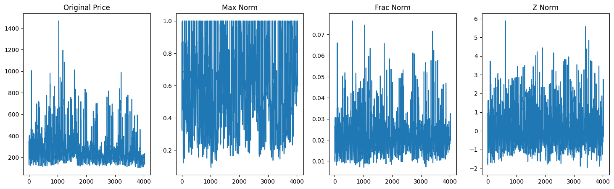
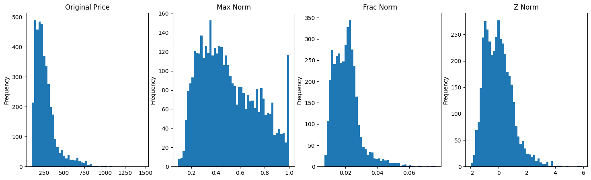
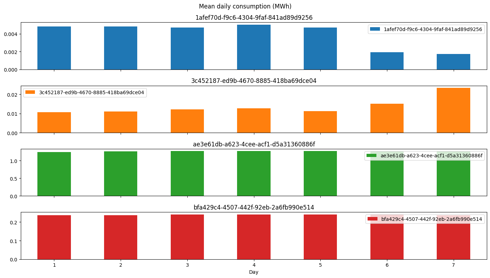
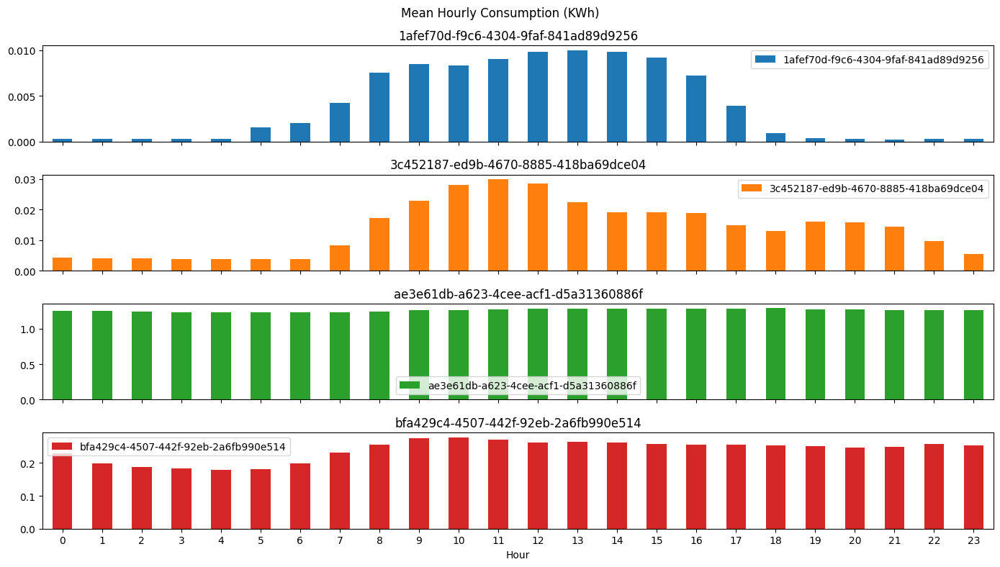
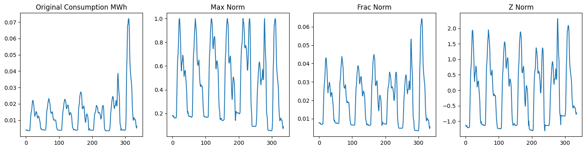
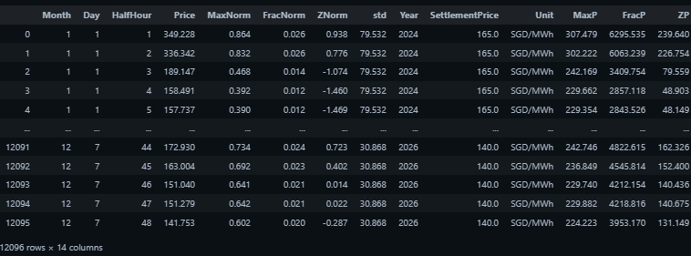
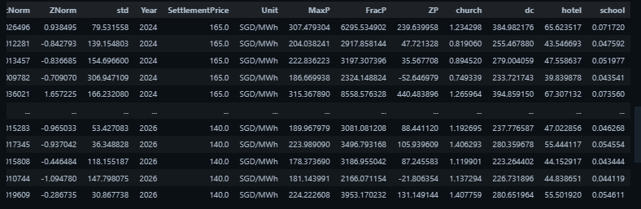
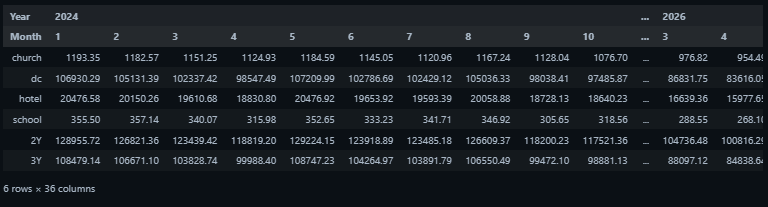
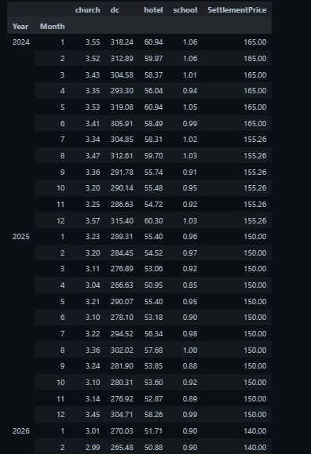
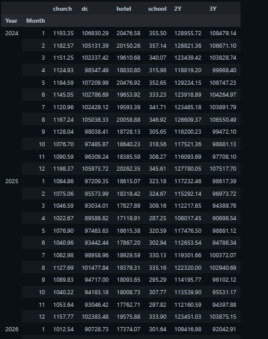

# Power Trading Firm - Technical Assignment (Trading & Portfolio Management Team)

This repo is my solution to the take home technical assignment for a retail power trading company for a __power trading analyst__ role. My submission was well done and the best out of all the candidates (I was informed). However, the day before my presentation at their office, a senior employee (a software engineer) had requested to lateral into the role, taking the headcount, and I was rejected. Despite this happening, they went ahead with the presentation, only choosing to inform me a day after.

Given the effort put into this assignment: I am thus posting this for any power-trading related roles. The answers and code are in `answers.ipynb`.

# Introduction

As discussed during your first interview, the Trading and Portfolio Management team of (redacted) is mostly involved with energy pricing and purchasing, so it makes sense to base our technical assessment on these two elements. You will be working with 3 small datasets with spot prices, futures settlements and consumption data, these will typically be your starting point for many analyses within (redacted):


* _Spot prices_ are the half hourly realized market prices (SGD per MWh) for electricity in Singapore. This market is operated by the EMC and creates a price for each half hour for generators to sell their energy and end consumers or retailers to buy their electricity demand for that particular half hour period. The prices are capped at a maximum of 4500 SGD per MWh, negative prices for oversupply rarely happen because of the low generation share of renewable energy. There are quite a few safety mechanisms in place (e.g. demand response) to prevent these price spikes to the maximum from happening, but they do occur from time to time and tend to cluster. They are difficult to predict by nature, usually the result of a combination of high demand resulting from weather circumstances and undersupply due to maintenance or outages, and can have a large impact on Flo’s profitability.
* _Futures price_ settlements typically represent the latest market consensus outlook (SGD per MWh) on what the average of spot prices is going to be between a particular start and end date (e.g. Q1 '24). Flo uses these futures prices to offer customers a contract price for a certain period. In Singapore these contracts usually trade for a range of quarters, but the underlying month averages may vary quite a bit due to e.g. weather conditions and the number of public holidays.
* Consumption data are typically received in half hourly kWh values. Reminder: 1 MWh = 1000 kWh.

# Questions

1. Treating the SpotPrices_EMC CSV like it is a table named spotprices, write a SQL query to analyse the average, min and max price and demand values per year-month combination for 2022 and 2023.

First, we load in the data and do some data cleaning:

* Parsing datetimes
* Creating year, month, hour, halfhour columns, etc.
* Resampling/backfilling the settlements data to the right frequency for later use

```Python
import pandas as pd
import numpy as np
import warnings
from pandasql import sqldf
import matplotlib.pyplot as plt
from scipy.stats import zscore
from sklearn import preprocessing
warnings.filterwarnings('ignore')


def parse_dates(filename):
    df = pd.read_csv(filename, index_col='Date', parse_dates=True)
    df.index = df.index + pd.to_timedelta((df['HalfHour'])*30, unit='minutes')
    df['Date'] = df.index
    df['Year'] = df.index.year.astype(int)
    df['Month'] = df.index.month.astype(int)
    df['Hour'] = df.index.hour.astype(int)
    df['Day'] = df.index.dayofweek.astype(int) + 1
    cols = df.columns.tolist()
    df =  df[cols[-5:] + cols[:-5]]
    df.dropna(inplace=True, axis=1)

    return df

def parse_settlements(filename):
    df = pd.read_csv(filename, parse_dates=True).dropna(axis=1)
    df['StartDelivery'] = pd.to_datetime(df['StartDelivery'], format='%d/%m/%Y')
    df['EndDelivery'] = pd.to_datetime(df['EndDelivery'], format='%d/%m/%Y')
    df.index = df.EndDelivery
    df = df.resample('M').bfill()
    df['Month'] = df.index.month
    df['Year'] = df.index.year
    return df[['Year','Month','SettlementPrice','Unit']]

spot = parse_dates('SpotPrices_EMC.csv').iloc[:-1,:]
consumption = parse_dates('Consumption.csv')
consumption['Consumption'] = consumption['Consumption']/1e3
consumption['Unit'] = 'MWh'
settlements = parse_settlements('Settlements_SGX.csv')
```

Then, we use `pandasql` with `SQLite` syntax

```Python
pysqldf = lambda q: sqldf(q, globals())

q1 = """
    SELECT 
        strftime('%Y', Date) AS year, 
        strftime('%m', Date) AS month, 
        AVG(Price) AS average_price, 
        MIN(Price) AS min_price, 
        MAX(Price) AS max_price, 
        AVG(TotalSystemDemandMW) AS average_demand, 
        MIN(TotalSystemDemandMW) AS min_demand, 
        MAX(TotalSystemDemandMW) AS max_demand
    FROM 
        spot
    WHERE 
        strftime('%Y', Date) IN ('2022', '2023')
    GROUP BY 
        year, 
        month
    LIMIT
        10;
"""

a1 = pysqldf(q1)
```


---

2. Now use the historical half hourly price patterns to create a normalized half hourly price pattern per half hour per weekday per month. You will be asked later to apply this on quarterly futures settlement price data. Write down your (data and portfolio management strategic) assumptions for this half hourly price curve. Also write out how you would query this in SQL.

| Month | Weekday | HalfHour | Normalized Pricing Pattern |
|-------|---------|----------|-----------------------------|
| 1     | 1       | 1        | x%                          |


I first groupby `Month`, `Weekday`, `HalfHour`, then calculate the mean values. To normalize, we must decide on a _time frame_ and _method_.

For time frame, I normalize across each day, i.e by 48 half-hour intervals. For method:

* `MaxNorm` - Divide each half hour interval by the maximum price of that day
* `FracNorm` - Divide each half hour interval by the sum of prices of that day
* `ZNorm` - Z-score each half hour interval with the mean and std of that day


In actual SQL, I would use CTEs to store the results of `raw_q` and `norm_q` before joining them together.

The SQL below calculates `MaxNorm` and `FracNorm`.

```Python
raw_q = """
    SELECT
        strftime('%m', Date) AS Month,
        strftime('%w', Date) AS Day,
        HalfHour,
        AVG(Price) as Price
    FROM
        spot
    GROUP BY
        Month,
        Day,
        HalfHour
"""


norm_q = """
    SELECT 
        Month, 
        Day, 
        MIN(Price) AS MinPrice, 
        MAX(Price) AS MaxPrice,
        SUM(Price) AS SumPrice,
        AVG(Price) AS StdPrice
    FROM 
        raw
    GROUP BY 
        Month, 
        Day
"""

join_q = """
    SELECT
        r.Month,
        r.Day,
        r.HalfHour,
        r.Price,
        r.Price/m.MaxPrice AS MaxNorm,
        r.Price/m.SumPrice as FracNorm
    FROM
        raw r
    INNER JOIN
        minmax m ON r.Month = m.Month AND r.Day = m.Day
"""

raw = pysqldf(raw_q)
minmax = pysqldf(norm_q)
n_price = pysqldf((join_q))
n_price[['Month','Day','HalfHour']] = n_price[['Month','Day','HalfHour']].astype(int)
```

The same normalization can be done in Pandas in a much easier fashion:

```Python
def group(df):
    return df.groupby(['Month', 'Day']).Price


n_price = pd.DataFrame(spot.groupby(['Month','Day','HalfHour']).Price.mean()).reset_index()

n_price['MaxNorm'] = group(n_price).transform(lambda x: x/x.max())
n_price['FracNorm'] = group(n_price).transform(lambda x: x/x.sum())
n_price['ZNorm'] = group(n_price).transform(lambda x: zscore(x, ddof=1))
n_price['std'] = group(n_price).transform(lambda x: x.std())
```

<br>
<p align='center'>

<!-- <p align='center'> stocks</p align='center'> -->
</p align='center'>
<br>

<p align='center'>

<!-- <p align='center'> stocks</p align='center'> -->
</p align='center'>
<br>

---

3. The consumption data contains a hotel, a data centre, a school and a church. Correctly label the connection ids with their industry type and write down your reasoning for why which one is which.

```Python
consumption_dow = consumption.groupby(['ConnectionId','Day']).mean().Consumption
consumption_hourly = consumption.groupby(['ConnectionId','Hour']).mean().Consumption
fig, ax = plt.subplots(1,2, figsize=(14,8))
consumption_dow.unstack(level=0).plot(kind='bar',subplots=True, rot=0, figsize=(15,10), layout=(4,1), ax=ax[0], sharex=True, title='Mean daily consumption (MWh)')
plt.tight_layout()
consumption_hourly.unstack(level=0).plot(kind='bar',subplots=True, rot=0, figsize=(14,8), layout=(4,1), title='Mean Hourly Consumption (KWh)')
plt.tight_layout()
```

<p align='center'>

<!-- <p align='center'> stocks</p align='center'> -->
</p align='center'>
<br>

<p align='center'>

<!-- <p align='center'> stocks</p align='center'> -->
</p align='center'>
<br>

Blue (School)

* Daily: The blue chart shows a sharp drop off during weekends, implying it is a school.
* Hourly: The load is higher during school/working hours, for example, at 7am school starts, by 6pm everyone has left.

Orange (Church)

* Daily: Consumption doubles on Sunday and small spike on Wednesday, which implies it is a Church since people go to Church on Sundays and sometimes Wednesdays.
* Hourly: Peak during morning to early afternoon when people attend church.

Green (Datacenter)

* Daily: The mean consumption is ~1200 kwH and is 5x higher than the next highest connection which is red. Then it must be the datacenter since it consumes the most power. 
* Hourly: There is very little variance across hourly load, which implies it is a datacenter as it is always running 24/7.

Red (Hotel)

* Daily: Again, very similar to green.
* Hourly: We can see a drop off in morning hours when people are sleeping, letting us infer it is a hotel.

---

4. For each of these, create a normalized half hourly consumption pattern per half hour per weekday based on their available historical data. For simplicity you don’t have to consider seasonality effects (e.g. more demand with higher temperature) and the effect of public holidays (less consumption during days off). Expected output would look something like this

| Weekday | HalfHour | Normalized Consumption Pattern |
|---------|----------|-----------------------------|
| 1       | 1        | x%                          |

```Python
def group(df):
    return df.groupby(['Connection','Day']).Consumption

# map the consumption Id to name
keys = consumption.ConnectionId.unique()
values = ['school','church','dc','hotel']
mapping =  {k: v for k,v in zip(sorted(keys), values )}

# generate normalized prices
consumption['Connection'] = consumption['ConnectionId'].map(mapping)
n_consumption = pd.DataFrame(consumption.groupby(['Connection','Day','HalfHour'])['Consumption'].mean()).reset_index()


n_consumption['MaxNorm'] = group(n_consumption).transform(lambda x: x/x.max())
n_consumption['FracNorm'] = group(n_consumption).transform(lambda x: x/x.sum())
n_consumption['ZNorm'] = group(n_consumption).transform(lambda x: zscore(x, ddof=1))
n_consumption['std'] = group(n_consumption).transform(lambda x: x.std())
```
We can plot it out similar to our normalized prices:

<br>

<p align='center'>

<!-- <p align='center'> stocks</p align='center'> -->
</p align='center'>
<br>


---

5. The settlement prices Settlements_SGX CSV shows the market price expectations for 2024-2026.

* Use your normalized half hourly price curve and your half hourly consumption curve on the settlement prices and consumption volumes to create half hourly expected market prices (SGD/MWh) and half hourly expected consumption volumes (MWh) per connection between 01-01-2024 and 31-12-2026. 


 To apply the normalized half hour price curve to the settlement price:

* `MaxNorm`: I thought of baseload. I take the max-normed price, add 1 to it and multiply it by the settlement price.  
* `FracNorm`: Take settlement price, multiply by 48, then multiply by fraction.
* `ZNorm`: Use formula $x=\mu + \sigma z$ where $\mu$ is settlement price. This didn't give realistic values so I discarded this option.

To apply the half hourly consumption curve to consumption volume, I am not sure what this means, so I just took the consumption values as they were.

```Python
# List to store the DataFrames
ex_prices = []
ex_consumption = []

# Loop to create and append DataFrames for each year
for year in [2024, 2025, 2026]:
    df_copy = n_price.copy()
    df_copy['Year'] = year
    ex_prices.append(df_copy)

    c_copy = n_consumption.copy()
    c_copy['Year'] = year
    ex_consumption.append(c_copy)

# expected prices
ex_prices = pd.concat(ex_prices, ignore_index=True)
ex_prices = ex_prices.merge(settlements, on=['Year','Month'])

ex_prices['MaxP'] = ex_prices.SettlementPrice * (1+ ex_prices.MaxNorm)
ex_prices['FracP'] = ex_prices.SettlementPrice * 48 * 30 * ex_prices.FracNorm
ex_prices['ZP'] = ex_prices.SettlementPrice + ex_prices.ZNorm * ex_prices['std']


# expected consumption
ex_consumption = pd.concat(ex_consumption, ignore_index=True)
```
<p align='center'>

<!-- <p align='center'> stocks</p align='center'> -->
</p align='center'>
<br>

I multiply expected prices $SGD/MWh$ by Consumption $MWh$ gives the half-hourly cost in $SGD$ for each connection using both `MaxP` and `FracP`:

```Python

def create_costs(ex_prices, ex_consumption, method):
    for c in ex_consumption.Connection.unique().tolist():
        ex_prices = ex_prices.merge(ex_consumption[ex_consumption.Connection==c][['Year','Day','HalfHour','Consumption']], on=['Year','Day','HalfHour'])
        if method == 'MaxP':
            ex_prices['Consumption'] = ex_prices.Consumption * ex_prices.MaxP
        if method == 'FracP':
            ex_prices['Consumption'] = ex_prices.Consumption * ex_prices.FracP

        ex_prices = ex_prices.rename(columns={'Consumption':c})    
    return ex_prices

max_costs = create_costs(ex_prices, ex_consumption, 'MaxP')
frac_costs = create_costs(ex_prices, ex_consumption, 'FracP')
```

<p align='center'>

<!-- <p align='center'> stocks</p align='center'> -->
</p align='center'>
<br>


* Combine these to arrive at each connection’s monthly expected energy costs between 01-01-2024 and 31-12-2026 for each of these customers.

```Python
max_month = max_costs.groupby(['Year','Month'])[['church','dc','hotel','school']].sum().round(2)
frac_month = frac_costs.groupby(['Year','Month'])[['church','dc','hotel','school']].sum().round(2)
```

<p align='center'>

<!-- <p align='center'> stocks</p align='center'> -->
</p align='center'>
<br>


* Calculate the assumed costs per MWh for each connection vs the average settlement monthly price, and the difference value (delta) between the two. What does a high delta indicate?

A high delta indicates a large difference in the cost of electricity for that connection for that month and the cost of 1 MWH of electricity from the settlement.

```Python
max_mean_cost = max_costs.groupby(['Year','Month'])[['church','dc','hotel','school', 'SettlementPrice']].mean().round(2)
frac_mean_cost = frac_costs.groupby(['Year','Month'])[['church','dc','hotel','school', "SettlementPrice"]].mean().round(2)
max_mean_cost
```

<p align='center'>

<!-- <p align='center'> stocks</p align='center'> -->
</p align='center'>
<br>

---

6. Assuming a 2-year contract for the hotel, and 3-year contracts for the remaining connections starting 1-1-2024, calculate how much energy we would have to buy in total per month for this small retail portfolio.

```Python
max_month['2Y'] = max_month.sum(axis=1)
max_month['3Y'] = max_month['2Y'].sub(max_month.hotel)

frac_month['2Y'] = frac_month.sum(axis=1)
frac_month['3Y'] = frac_month['2Y'].sub(frac_month.hotel)
```

<p align='center'>

<!-- <p align='center'> stocks</p align='center'> -->
</p align='center'>
<br>
